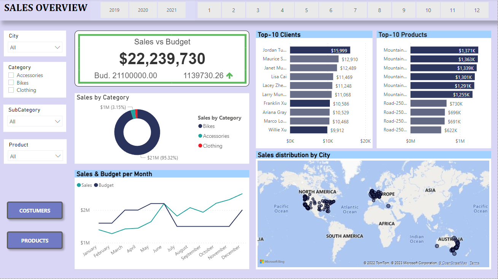
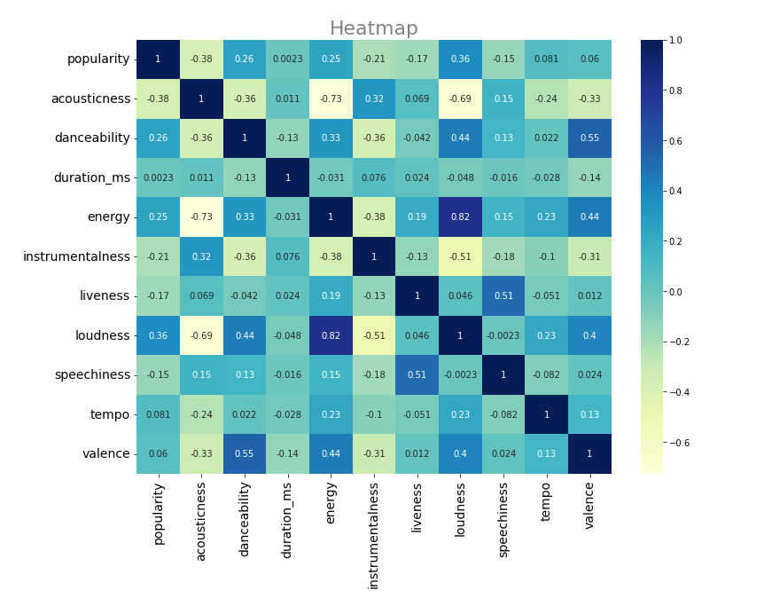

### My projects by Subhojit Das

# [SALES MANAGEMENT DATA ANALYSIS PROJECT](https://subhojitdas859.github.io/Sales_Management/)

### Project overview
- This project explores different business metrics and how they can be displayed graphically to follow them.
- Explored the relation between sales, budget, customers and products.
- The tools used for this analysis are **SQL and Power BI.**
- **Impact:** We can obtain conclusions that will help us to make better marketing campaigns for our products and increase overall profits.

You can access the whole project **[HERE](https://subhojitdas859.github.io/Sales_Management/)**

# [MUSIC TRENDS ANALYSIS - PYTHON](https://subhojitdas859.github.io/Music_Trends_Analysis/)
### Project overview
- We need to know which factors influence the popularity of a song.
- Identifying patterns and relationships between attributes.
- The python libraries used were **pandas, numpy, matplotlib, seaborn.**
- **Conclusion:** It was found that people on Spotify prefer to listen to music that is loud, energetic, and good for dancing.

You can access the whole project **[HERE.](https://subhojitdas859.github.io/Music_Trends_Analysis/)**

